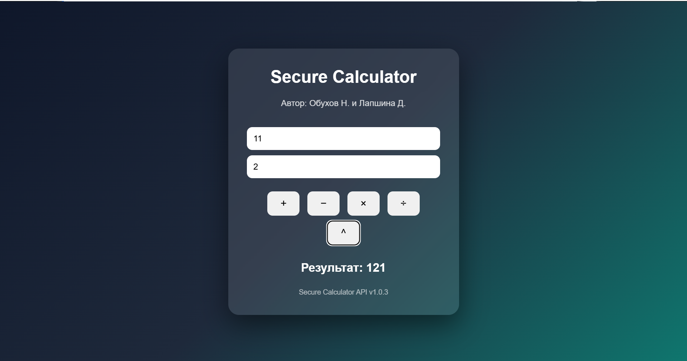

# Secure Calculator API

[](https://github.com/Nikisisisi/Secure-calculator/actions/workflows/ci.yml)

Учебный проект по дисциплине **«Методы оценки безопасности компьютерных систем»**.

**Авторы:** Nikita Obukhov & Daria Lapshina

---

## О проекте

Secure Calculator — API-калькулятор, разработанный на Python с использованием FastAPI.

Приложение поддерживает:

- сложение;
- вычитание;
- умножение;
- деление;
- возведение в степень;
- обработку деления на ноль;
- проверку входных данных;
- веб-интерфейс;
- автоматическую документацию Swagger;
- автоматические тесты;
- запуск в Docker-контейнере.

---

## Интерфейс приложения

Ниже представлен веб-интерфейс калькулятора:



---

## Используемые технологии

- Python 3.13
- FastAPI
- Uvicorn
- Pydantic
- Pytest
- Docker
- Git
- GitHub

---

# Быстрый запуск через Docker

Это рекомендуемый способ запуска проекта.

## 1. Клонировать репозиторий

```bash
git clone https://github.com/Nikisisisi/Secure-calculator.git
```

Перейти в папку проекта:

```bash
cd Secure-calculator
```

## 2. Собрать Docker-образ

```bash
docker build -t secure-calculator:1.0 .
```

## 3. Запустить контейнер

```bash
docker run -d --name secure-calculator -p 8000:8000 secure-calculator:1.0
```

## 4. Открыть приложение

Веб-интерфейс:

```text
http://127.0.0.1:8000/web
```

Swagger UI:

```text
http://127.0.0.1:8000/docs
```

Проверка состояния API:

```text
http://127.0.0.1:8000/health
```

## 5. Остановить контейнер

```bash
docker stop secure-calculator
```

Удалить контейнер:

```bash
docker rm secure-calculator
```

---

# API

Калькулятор предоставляет следующие методы:

| Метод | Endpoint | Описание |
|---|---|---|
| GET | `/` | Информация о работе API |
| GET | `/health` | Проверка состояния приложения |
| GET | `/web` | Веб-интерфейс калькулятора |
| POST | `/calculate/add` | Сложение |
| POST | `/calculate/subtract` | Вычитание |
| POST | `/calculate/multiply` | Умножение |
| POST | `/calculate/divide` | Деление |
| POST | `/calculate/power` | Возведение в степень |


Пример запроса:

```json
{
  "a": 10,
  "b": 5
}
```

Пример ответа:

```json
{
  "result": 15
}
```

При попытке деления на ноль API возвращает HTTP-ошибку `400`.

---

# Автоматические тесты

Для проекта реализованы автоматические тесты с использованием `pytest`.

Проверяются:

- корневой endpoint;
- health-check;
- сложение;
- вычитание;
- умножение;
- деление;
- возведение в степень;
- деление на ноль;
- некорректные входные данные;
- работа веб-интерфейса.

Всего реализовано:

```text
10 tests
```

Запуск тестов:

```bash
python -m pytest
```

Текущий результат:

```text
10 passed
```

---

# ⚡ Проверка производительности

Для базовой проверки производительности API было выполнено **100 последовательных POST-запросов** к методу:

```text
POST /calculate/add
```

Результаты локального тестирования приложения в Docker-контейнере:

| Показатель | Результат |
|---|---:|
| Количество запросов | 100 |
| Среднее время | 10.59 мс |
| Минимальное время | 8.34 мс |
| Максимальное время | 20.22 мс |

Тест выполнялся локально через PowerShell.

Результаты являются ориентировочными и не представляют собой полноценное нагрузочное тестирование.

---

# Локальный запуск без Docker

Создать виртуальное окружение:

```bash
python -m venv .venv
```

Для Windows PowerShell активировать его:

```powershell
.\.venv\Scripts\Activate.ps1
```

Установить зависимости:

```bash
pip install -r requirements.txt
```

Запустить приложение:

```bash
uvicorn app.main:app --reload
```

После запуска приложение будет доступно по адресу:

```text
http://127.0.0.1:8000
```

---

# 📁 Структура проекта

```text
secure-calculator/
├── app/
│   ├── __init__.py
│   ├── main.py
│   └── index.html
│
├── assets/
│   └── web-ui.png
│
├── tests/
│   └── test_calculator.py
│
├── .dockerignore
├── .gitignore
├── Dockerfile
├── README.md
└── requirements.txt
```

---

# 🐳 Docker

Проект использует базовый образ:

```text
python:3.13-slim
```

Приложение внутри контейнера запускается через Uvicorn и использует порт:

```text
8000
```

---

# CI/CD и автоматическое версионирование

Для проекта настроен CI-пайплайн с использованием **GitHub Actions**.

Конфигурация пайплайна находится в:

```text
.github/workflows/ci.yml
```

Pipeline автоматически запускается при каждом push в ветку `main`.

Последовательность выполнения:

```text
Push в main
      ↓
Получение исходного кода
      ↓
Настройка Python 3.13
      ↓
Установка зависимостей
      ↓
Автоматическое обновление версии
      ↓
Запуск pytest
      ↓
Сборка Docker-образа
      ↓
Автоматический commit новой версии
```

Для хранения текущей версии используется файл:

```text
VERSION
```

Для автоматического повышения версии используется скрипт:

```text
scripts/bump_version.py
```

Используется схема версий:

```text
MAJOR.MINOR.PATCH
```

На данном этапе pipeline автоматически увеличивает `PATCH`-часть версии:

```text
1.0.0 → 1.0.1 → 1.0.2
```

Новая версия автоматически используется:

- FastAPI-приложением;
- Swagger;
- веб-интерфейсом;
- Docker-образом;
- README;
- файлом `VERSION`.

## Пример работы pipeline

В версию `1.0.1` был добавлен новый API-метод:

```text
POST /calculate/power
```

После отправки изменений в GitHub pipeline автоматически:

1. запустил тесты;
2. успешно выполнил 10 тестов;
3. собрал Docker-образ новой версии;
4. обновил номер версии;
5. изменил `VERSION` с `1.0.1` на `1.0.2`;
6. обновил версию в README;
7. создал автоматический commit.

Таким образом, изменение функциональности приложения при push автоматически проходит проверку и приводит к созданию новой версии.

# Версия

Текущая версия приложения:

<!-- VERSION:START -->
`1.0.3`
<!-- VERSION:END -->

---

# Следующие этапы

В дальнейшем проект будет дополнен:

- CI/CD-пайплайном;
- автоматическим обновлением версии;
- Semgrep;
- Trivy;
- анализом найденных уязвимостей;
- улучшениями безопасности приложения.